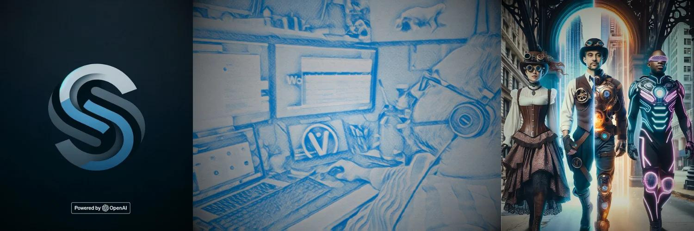
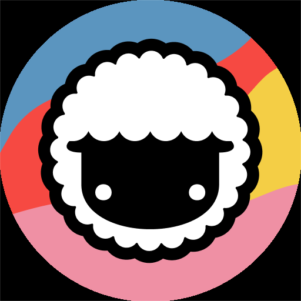

  

  
  
  

  
<h1>
  🙌🏽 heya 🤩
</h1>

### 👨🏾‍💻 About Me :
- :zap: I’m building Generative AI products on <a href="https://skinny.cloud">skinny.cloud</a> to showcase/share/collaborate on our rapid-prototypes 

- :seedling: Exploring POCs powered by OpenAI; GenAI, Autonomous Muli-Agents, LLMs, RAG, Vector & Graph DBs.

- :telescope: I'm on the lookout for brilliant creatives to collab with.

- 🤝 Let's Connect: 
---

### 💻🗃️ Languages and Frameworks :

  &nbsp;
  &nbsp;
  &nbsp;
  &nbsp;
  &nbsp;
  &nbsp;
  

### 🎨🛠️ Platform and Tools :

  &nbsp;
  &nbsp;
  &nbsp;
  &nbsp;
  &nbsp;
  &nbsp;
  &nbsp;
  &nbsp;
  &nbsp;
  &nbsp;
  

---

### :fire: My Stats :

<!--
**awaliuddin/awaliuddin** is a ✨ _special_ ✨ repository because its `README.md` (this file) appears on your GitHub profile.

Here are some ideas to get you started:

- 🔭 I’m currently working on ...
- 🌱 I’m currently learning ...
- 👯 I’m looking to collaborate on ...
- 🤔 I’m looking for help with ...
- 💬 Ask me about ...
- 📫 How to reach me: ...
- 😄 Pronouns: ...
- ⚡ Fun fact: ...
-->
